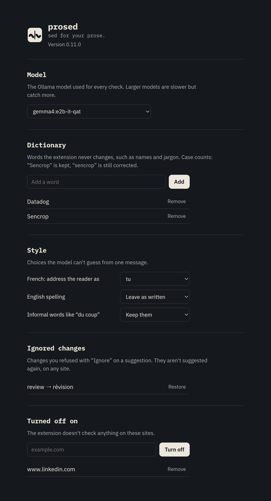

<p align="center"></p>

# prosed

`sed for your prose.`

A grammar checker that runs on your machine. It works in Chromium browsers, and a [desktop app](#desktop-app) brings it to every app on macOS and Windows. A language model on your own computer reads what you type, so the text never leaves it.

Mistakes are underlined in place, one click fixes one word, and the default model is small enough to leave running all day. It's free, open source, and has no account. You install it [from a release zip or from source](#install-the-extension).

| Fix one word | Review every suggestion |
| :---: | :---: |
|  |  |
| Hover an underlined word, then click the green fix. | Hover the badge to see every change. Click one, or "Accept all". |

## Contents

- [What it does](#what-it-does)
- [Compared to the original extension](#compared-to-the-original-extension)
- [Requirements](#requirements)
- [Install the extension](#install-the-extension)
  - [One line agent install](#one-line-agent-install)
- [Set up a model](#set-up-a-model)
- [Using it](#using-it)
  - [Rewrites](#rewrites)
  - [Tone](#tone)
  - [Natural English](#natural-english)
- [Troubleshooting](#troubleshooting)
- [Settings](#settings)
- [Benchmark](#benchmark)
- [Developing](#developing)
- [Desktop app](#desktop-app)
- [Privacy](#privacy)
- [Credits and license](#credits-and-license)

## What it does

You type in a text field. When you stop for half a second, the extension sends the text to a local model and asks for the smallest set of fixes: spelling, grammar, punctuation, missing accents. It keeps your language, tone and technical terms. A French Slack message about a "PR" stays French and keeps "PR".

- Free, no account, no ads.
- The model runs on your machine: [Ollama](https://ollama.com) or Chrome's built-in Gemini Nano.
- It reads whole sentences, so it catches agreement errors and homophones ("sa" / "ça", "on" / "ont") that a word-by-word spell checker misses.

## Compared to the original extension

- Mistakes are underlined inside the field, in both `<textarea>` and `contenteditable` elements.
- Hovering an underlined word opens a card with its fix. Clicking the fix replaces that word and nothing else.
- Hovering the badge in the corner of the field lists every suggestion. You can apply them one by one or all at once.
- Edits go through the browser's editing commands, so Cmd+Z / Ctrl+Z undoes them and frameworks like React see the change.
- The check waits until you stop typing for 500 ms instead of running on every keystroke.
- Ollama uses `gemma4:e2b-it-qat` by default. It fixed every case in the [benchmark](#benchmark), in about half a second.
- The extension asks Ollama to keep the model loaded, so checks don't pay a loading delay after a pause.
- The overlays pick a light or dark look from the text color of the field, and respect `prefers-reduced-motion`.
- A settings page picks the Ollama model, holds a personal dictionary of words to leave alone, and turns the extension off on chosen sites.
- Select some text, or hover a sentence longer than 30 words, to get three rewrites of it. Rewrites are drawn in violet, apart from the red fixes, and a variant that drops a number, a name or a link is never shown.
- "Ignore" on a suggestion refuses that change for good, on every site. The settings list the ignored changes and set a few style preferences: "tu" or "vous", US or UK spelling, and whether informal words count as mistakes.
- The Ollama request passes a real JSON schema. Upstream passed a zod object, which recent Ollama servers reject with a 500.

## Requirements

You need one of the two model setups below. If both are available, the extension uses Ollama.

| | Ollama (recommended) | Chrome built-in AI |
| --- | --- | --- |
| Browser | Any Chromium browser that loads unpacked extensions: Chrome, Arc, Edge, Brave | Google Chrome 138 or newer. Other Chromium browsers don't ship the model |
| OS | macOS, Windows, Linux | Windows 10/11, macOS 13+, Linux, ChromeOS on Chromebook Plus |
| Memory | 8 GB of RAM at minimum, 16 GB to stop thinking about it. The model takes 3.8 GB once loaded | 16 GB of RAM and 4 CPU cores, or a GPU with more than 4 GB of VRAM |
| Disk | 4.3 GB for the model, plus Ollama itself | 22 GB free on the drive that holds your Chrome profile |
| Other | Ollama 0.34 or newer | An unmetered connection for the first model download |

The Chrome figures come from [Google's Prompt API docs](https://developer.chrome.com/docs/ai/prompt-api#hardware-requirements). The Ollama memory figure is what `ollama ps` reports with the model loaded. The 8 GB minimum is an estimate, not a measurement.

The Ollama path is tested on a MacBook Pro M2 Pro with 32 GB of RAM, in Arc. The Chrome built-in path uses the same prompt but hasn't been tested since the fork.

## Install the extension

There are three ways. An agent can do it for you. The zip needs nothing but the browser. Building from source needs [git](https://git-scm.com) and [Node.js](https://nodejs.org) 20.19 or newer (the build is tested with Node 26), and is the way to go if you want to change the model or the code.

### One line agent install

If you use a coding agent with shell access (Claude Code, Codex, Cursor and the like), paste this into it:

```text
Install the prosed browser extension on this machine by following https://raw.githubusercontent.com/florianlauer/prosed/main/AGENT_INSTALL.md
```

The agent checks or installs Ollama, downloads the model, sets `OLLAMA_ORIGINS`, checks that Ollama accepts the extension, and unzips the latest release into `~/Extensions/prosed`. It asks before installing software, using `sudo` or changing how Ollama starts. You still load the extension in the browser yourself, and the agent tells you what to click. [AGENT_INSTALL.md](./AGENT_INSTALL.md) lists every step it follows.

### From a release zip

1. Download `prosed-<version>.zip` from the [latest release](https://github.com/florianlauer/prosed/releases/latest).
2. Unzip it into a folder you'll keep, for example `~/Extensions/prosed`. The browser loads the extension from that folder every time it starts, so don't unzip it in Downloads and then clean Downloads up.
3. Open the extensions page of your browser: `chrome://extensions`, `arc://extensions`, `edge://extensions` or `brave://extensions`.
4. Turn on "Developer mode".
5. Click "Load unpacked" and pick the unzipped folder. It is the one that contains `manifest.json`.
6. Reload any tab that was already open. The extension only attaches to pages loaded after it.

Browsers can't install the zip itself, and an unpacked extension doesn't update on its own. To update, unzip the new release over the same folder, then click the reload icon on the extension's card.

### From source

1. Get the code and build it:

```shell
git clone https://github.com/florianlauer/prosed.git
cd prosed
npm install
npm run build
```

2. Open the extensions page of your browser and turn on "Developer mode", as in the zip steps above.
3. Click "Load unpacked" and pick the `build` folder inside the repository.
4. Reload any tab that was already open.

To update later, run `git pull && npm run build`, then click the reload icon on the extension's card.

## Set up a model

### Option A: Ollama

**1. Install Ollama.**

- macOS: download the app from [ollama.com/download](https://ollama.com/download), or `brew install ollama`.
- Windows: run the installer from [ollama.com/download](https://ollama.com/download).
- Linux:

```shell
curl -fsSL https://ollama.com/install.sh | sh
```

Check the version. You need 0.34 or newer, because older servers don't know the `gemma4` models:

```shell
ollama --version
```

**2. Download the model.**

```shell
ollama pull gemma4:e2b-it-qat
```

**3. Let the extension talk to Ollama.**

Ollama refuses requests coming from browser extensions unless their origin is listed in `OLLAMA_ORIGINS`. Without it every check fails with a 403. The variable has to be set on the process that runs the server, and how you do that depends on how you start Ollama.

<details>
<summary>macOS, with the menu bar app</summary>

```shell
launchctl setenv OLLAMA_ORIGINS "chrome-extension://*"
```

Then quit Ollama from the menu bar and open it again. Two catches. `launchctl setenv` only reaches apps that launchd starts, so it does nothing for an `ollama serve` typed in a terminal. And it is forgotten when the Mac restarts. For a setup that survives reboots, use the LaunchAgent in step 5.

</details>

<details>
<summary>Linux, with the systemd service from the install script</summary>

```shell
sudo systemctl edit ollama.service
```

Add these lines, save, then restart the service:

```ini
[Service]
Environment="OLLAMA_ORIGINS=chrome-extension://*"
```

```shell
sudo systemctl daemon-reload
sudo systemctl restart ollama
```

</details>

<details>
<summary>Windows</summary>

Quit Ollama from the taskbar. Open the settings, search for "environment variables", and choose "Edit environment variables for your account". Add a variable named `OLLAMA_ORIGINS` with the value `chrome-extension://*`, then start Ollama again from the Start menu.

</details>

<details>
<summary>Any OS, running <code>ollama serve</code> yourself</summary>

```shell
OLLAMA_ORIGINS="chrome-extension://*" ollama serve
```

</details>

`chrome-extension://*` lets every installed extension call your local Ollama. If you'd rather allow only this one, copy its ID from the extensions page and use `chrome-extension://<id>`. The ID changes if you load the `build` folder from another path.

**4. Check that it works.**

```shell
curl -s -o /dev/null -w "%{http_code}\n" -H "Origin: chrome-extension://test" http://127.0.0.1:11434/api/tags
```

`200` means the extension will get through. `403` means `OLLAMA_ORIGINS` didn't reach the server. No answer means the server isn't running.

**5. Optional: start Ollama at login (macOS).**

The Windows app and the Linux service already start at boot.

<details>
<summary>LaunchAgent for macOS</summary>

On macOS, if you don't use the menu bar app, save this as `~/Library/LaunchAgents/com.ollama.serve.plist`. Adjust the path to `ollama` with the output of `which ollama`:

```xml
<?xml version="1.0" encoding="UTF-8"?>
<!DOCTYPE plist PUBLIC "-//Apple//DTD PLIST 1.0//EN" "http://www.apple.com/DTDs/PropertyList-1.0.dtd">
<plist version="1.0">
<dict>
  <key>Label</key>
  <string>com.ollama.serve</string>
  <key>ProgramArguments</key>
  <array>
    <string>/opt/homebrew/bin/ollama</string>
    <string>serve</string>
  </array>
  <key>EnvironmentVariables</key>
  <dict>
    <key>OLLAMA_ORIGINS</key>
    <string>chrome-extension://*</string>
  </dict>
  <key>RunAtLoad</key>
  <true/>
  <key>KeepAlive</key>
  <true/>
</dict>
</plist>
```

Load it once. It will then start at every login and restart if it crashes:

```shell
launchctl bootstrap gui/$(id -u) ~/Library/LaunchAgents/com.ollama.serve.plist
```

Don't run it alongside the menu bar app. Both try to use port 11434.

</details>

**About memory.** The extension asks Ollama to keep the model loaded forever (`keep_alive: -1`), which avoids a few seconds of loading after each pause. The cost is 3.8 GB of memory held while Ollama runs. To free it without stopping Ollama:

```shell
ollama stop gemma4:e2b-it-qat
```

The next check loads it again.

### Option B: Chrome built-in AI

Use Google Chrome 138 or newer on a machine that meets the [requirements](#requirements). There is nothing to install. The first check downloads Gemini Nano in the background, which can take a while. `chrome://on-device-internals` shows the model status.

### Which one the extension uses

When a page loads, the extension asks Ollama for its model list. If Ollama answers with at least one model, it uses Ollama. Otherwise it falls back to Chrome's built-in model. The choice holds until you reload the page. So if you start Ollama after opening a tab, reload that tab.

## Using it

Click into a text field and type. The badge in the bottom right corner of the field shows where things stand:

- A spinner while the model reads your text.
- A check mark when it found nothing to fix. It fades after a second or so.
- A red number when it has suggestions. The same words are underlined in the field.
- An orange icon when the check failed. Hover it to read the error.

Hover an underlined word to see its fix, and click the fix to apply it. If the word is right as written, a name or a term of your trade, click "Add to dictionary" under the fix: the suggestion goes away, and the extension never changes that word again.


If you just disagree with the fix, click "Ignore". The extension remembers that exact change, for example "review" → "révision", and doesn't suggest it again on any site. It remembers the whole word around the change, so ignoring a comma after "merci" doesn't hide the commas it suggests elsewhere.

Hover the badge to see all the changes in context. Click any change in that panel to apply only that one, or click "Accept all". Cmd+Z / Ctrl+Z undoes an applied fix. When the text has long sentences, the panel lists them under "Rewrites", below the fixes, and clicking one opens its rewrite card. The bottom of the panel links to the settings and turns the extension off on the current site.

The extension checks `<textarea>` elements and rich text editors built on `contenteditable`. It skips single-line `<input>` fields, and fields where the page turned spell checking off (`spellcheck="false"`). Gmail is the exception: it turns spell checking off because it has its own checker, so the extension checks its compose window anyway.

In editors that make the whole page editable, like Notion, the extension checks the block the caret is in rather than the whole page.

In emails, everything from the standard `-- ` signature line on is left out of the check, and so are blank lines.

Google Docs doesn't work. It draws text on a canvas instead of putting it in the page, so there is no text for the extension to read.

### Rewrites

Select at least two words in a checked field and a "Rewrite" button shows up under the selection. Click it and the card lists three rewrites after a second or two. Click one to put it in place of the selection. Cmd+Z / Ctrl+Z brings the old text back. A selection that cuts a word in half is widened to the whole word first.

Sentences longer than 30 words get a dashed violet underline. The extension finds them by counting words, without asking the model. Hovering one offers "Rewrite this sentence", and nothing runs until you click it, so moving the pointer over your text never starts the model.

When you select only part of a sentence, the model gets the words before and after it and has to write a part that fits between them. It still repeats the word just before, capitalizes the start, or ends with a full stop now and then, so the extension trims those before showing the variant.

Before showing a variant, the extension checks it. It has to keep every number, link, email address, dictionary word and capitalized name of the original, stay in the same language, and add no brackets or markdown. A variant that fails is dropped. If all of them fail, the card says so. A number up to twelve can be spelled out, in English or French, since small models do that all the time: gemma4 writes "two weeks" for "2 weeks", and qwen3.5:4b "dix minutes" for "10 minutes". Small models do fail the other checks: gemma4 translated a French sentence to English until the prompt started naming the language.

Rewrites run only when you ask. At 1.5 seconds each they are fine after a click and would be too slow on every typing pause.

### Tone

The rewrite card has a row of presets: "Clearer", the plain rewrite it starts with, then "More formal", "Friendlier", "More confident" and "Shorter". Click one to get three versions in that tone. The same checks apply, so a formal version that opens with "Cher/Chère [Nom]" is dropped for its brackets.

Above the presets, the card says how formal the text sounds, on a scale of five from "Very casual" to "Very formal". It is one short model call, made when the card opens. Asked to name the tone in words, gemma4 answered "friendly, curt, curt" for a neutral message. On the 1 to 5 scale it matched 10 of 12 labelled texts, and was never off by more than one step.

The presets also work on the whole field. Hover the badge, and the panel lists them under "Whole text". That text leaves out the email signature and the blank lines around it, like the check does.

### Natural English

For English written as a second language, the presets include "More natural". It shows up only when the text is in English. The extension looks for false friends in the text, English words used in their French sense: "actually" for "actuellement", "eventually" for "éventuellement", "assist to" for "assister à", "since 2 weeks" for "depuis 2 semaines". The list lives in `src/falseFriends.ts` and has 18 of them. The ones found in the text go into the prompt as words the writer may have used in the French sense, since some are right in English too ("Actually, I disagree"). The card lists them under "Words to check", so you can decide even when the model gets it wrong. Versions that still use one of them come last.

The false friends are also how the extension guesses the writer's language. When the field has some, the prompt says the text seems to come from "a native French speaker". The browser's language would be a worse guess, since many French speakers run their browser in English. With no false friend in the field, the prompt says nothing about the writer.

The list is written by hand because the model is bad at this. Asked to find the false friends itself, gemma4 missed "eventually" and "assisted to", and answered "actually" → "actually". Only French has a list for now.

It runs only when you ask, like the other presets. Flagging unnatural sentences while you type would cost a model call per sentence on every pause.

## Troubleshooting

<details>
<summary>The badge turns orange with "The extension was updated"</summary>

The extension was reloaded or updated after the tab was opened, and the old copy in that tab can't reach it anymore. Reload the tab.

</details>

<details>
<summary>No badge appears</summary>

Reload the tab, since the extension doesn't attach to pages opened before it was installed. Then check that the field is a textarea or a rich text editor, not a single-line input, and that the site doesn't disable spell checking on it.

</details>

<details>
<summary>The badge turns orange with a 403</summary>

Ollama doesn't allow the extension's origin. Go back to [step 3](#option-a-ollama) and run the `curl` check from step 4. On macOS, a restart erases what `launchctl setenv` set.

</details>

<details>
<summary>Orange badge, "model not found"</summary>

The model isn't downloaded, or has another name. Run `ollama pull gemma4:e2b-it-qat`, or pick a model you have in the [settings](#settings).

</details>

<details>
<summary><code>ollama pull</code> fails, or Ollama doesn't know the model</summary>

Your Ollama server is older than 0.34. Update it, then quit and restart it. After a Homebrew upgrade, the old server keeps running until you restart it, and `ollama --version` warns that client and server versions differ.

</details>

<details>
<summary>Ollama is running but nothing happens</summary>

The tab was opened before Ollama started, so the extension picked Chrome's built-in model or nothing. Reload the tab.

</details>

<details>
<summary>The first check is slow</summary>

Ollama is loading the model into memory, usually a few seconds. Later checks take about half a second.

</details>

<details>
<summary>Chrome built-in AI never answers</summary>

Open `chrome://on-device-internals` and check that the model is downloaded and your device is marked eligible.

</details>

<details>
<summary>The extension wants to change a word you wrote on purpose</summary>

Small models sometimes do. Don't click that suggestion, or undo it with Cmd+Z / Ctrl+Z. If it happens often in your language, try another model with the [benchmark](#benchmark).

</details>

<details>
<summary>Something else is off and you want to see what the extension does</summary>

Open the browser console on that site and run `localStorage.setItem("prosed:debug", "1")`. You don't need the caret in the text field for this. Reload the tab and type in the field. The console then logs, with a `[prosed]` prefix, which fields the extension watches, which one it checks or skips and why, which model it uses, and each state change. Include those lines when you [open an issue](https://github.com/florianlauer/prosed/issues/new). `localStorage.removeItem("prosed:debug")` turns it off.

</details>

## Settings

Click the extension's toolbar icon, or "Settings" at the bottom of the suggestions panel. The page has five sections:

- **Model.** The Ollama model used for every check, picked from the models Ollama has. Picking one unloads the previous model from Ollama to free its memory, then loads the new one while the page shows a loader, so the next check doesn't wait for it. No reload needed. Run the [benchmark](#benchmark) before switching: some models rewrite whole sentences, translate jargon, or add markdown around their answer. With Chrome's built-in model there is nothing to pick.
- **Dictionary.** Words the extension never changes. Case counts: with "Sencrop" in the dictionary, "Sencrop" is kept and "sencrop" is still corrected. The prompt asks the model to leave these words alone, and the extension also drops any suggestion that touches one, because a small model doesn't follow every instruction.
- **Style.** Three choices the model can't guess from one message. In French, address the reader as "tu" or "vous". In English, use US or UK spelling. Informal words like "du coup", "ouais" or "gonna" are kept by default, or counted as mistakes. Each choice adds one line to the prompt; with the defaults the prompt is the one the benchmark measured.
- **Ignored changes.** Every change you refused with "Ignore". "Restore" makes the extension suggest it again.
- **Turned off on.** Sites where the extension checks nothing. It accepts a hostname or a pasted URL.



Settings are stored with `chrome.storage.sync`, so they follow your browser profile to other machines when browser sync is on.

## Benchmark

`bench/grammar-bench.mjs` sends the extension's prompt to local Ollama models and checks each answer against the fixes it should contain, and the changes it must not make. It has two sets of French and English texts. `basic` has 14 short sentences with one or two mistakes each. `handwritten` has 10 longer messages typed fast, with missing accents, agreement errors and typos.

```shell
node bench/grammar-bench.mjs gemma4:e2b-it-qat qwen3.5:4b
CASES=handwritten node bench/grammar-bench.mjs gemma4:e2b-it-qat qwen3.5:4b
```

Each run writes `bench/report-<set>.md` with every input and every model's output, so you can judge the failures yourself. The grader accepts known valid variants, but it can still mark a correct answer as wrong.

`bench/rewrite-bench.mjs` does the same for rewrites. It sends the extension's rewrite prompt for 10 French and English texts, 4 of them parts of a sentence, and grades each variant with the checks the extension runs before showing one. It imports the prompt and the checks from `src/`, so it needs Node 23.6 or newer.

```shell
node bench/rewrite-bench.mjs gemma4:e2b-it-qat qwen3.5:4b
```

| Model | Cases with a variant shown | Variants kept | Median latency |
|---|---|---|---|
| gemma4:e2b-it-qat | 10/10 | 30/30 | 1.62s |
| qwen3.5:4b | 10/10 | 30/30 | 2.69s |

qwen3.5:4b used to lose two variants by writing "dix" for "10", until the number check accepted spelled-out numbers. The checks can't tell whether a rewrite kept the meaning: "it would be really good if we could maybe try to" became "we could try to", which passes. Read `bench/report-rewrite.md` for that.

`bench/tone-bench.mjs` grades the tone features. It runs the formality meter on 12 French and English texts labelled from 1 to 5, then each preset on 4 texts. A variant that passes the extension's checks also has to do what its preset says: sound more formal to the meter, have fewer hedges like "maybe" or "je pense", have fewer words, or, for "More natural" on English written by French speakers, have fewer false friends. "Friendlier" has no measurable goal, so it only has to pass the checks. The meter runs on the model under test, so "More formal" is graded by the model that wrote the variant.

"More natural" also runs on 4 correct English texts that the list flags anyway, like "Actually, I disagree" or "I passed the exam". There a variant fails if it brings in the French sense, such as "currently" or "took the exam".

```shell
node bench/tone-bench.mjs gemma4:e2b-it-qat qwen3.5:4b
```

| Model | Meter exact | Meter within one | Meter latency | More formal | Friendlier | More confident | Shorter | More natural | More natural, correct English |
|---|---|---|---|---|---|---|---|---|---|
| gemma4:e2b-it-qat | 10/12 | 12/12 | 0.30s | 11/11 | 12/12 | 12/12 | 11/11 | 12/12 | 11/11 |
| qwen3.5:4b | 9/12 | 12/12 | 0.67s | 11/12 | 12/12 | 12/12 | 12/12 | 12/12 | 11/12 |

"Fewer" isn't "none". All three of gemma4's versions of the first text still say "eventually", one of them "actually" too, and one version of another text turned "I assisted to the conference" into "I helped with the conference", the same misreading. That is why the card lists the words to check. On correct English, qwen3.5:4b once turned "I passed the exam" into "I took the exam".

Results on an M2 Pro with Ollama 0.34.4:

| Model | basic | handwritten | Median latency (basic / handwritten) |
|---|---|---|---|
| gemma4:e2b-it-qat | 14/14 | 10/10 | 0.40s / 0.58s |
| gemma3:4b | 11/14 | 8/10 | 0.68s / 0.97s |
| qwen3.5:4b | 11/14 | 7/10 | 0.82s / 1.14s |
| llama3.1 | 11/14 | 7/10 | 0.87s / 1.44s |
| qwen3:4b-instruct | 8/14 | 4/10 | 0.51s / 0.77s |
| ministral-3:3b | 8/14 | 4/10 | 0.45s / 0.68s |

## Developing

```shell
npm install
npm run build   # type check and build into build/
npm test        # unit tests for the text logic
npm run fmt     # format with prettier
npm run zip     # build, then zip build/ into package/ for a release
```

- `src/contentScript/index.ts` finds text fields, calls the model, and draws the badge, the underlines and the popovers.
- `src/contentScript/overlay.css` holds the overlay styles. They are scoped under `.aig-root` so the page's CSS can't reach them.
- `src/prompts.ts` holds the prompts. The benchmarks import it, so they send exactly what the extension sends.
- `src/falseFriends.ts` holds the false friends list for "More natural".
- `src/contentScript/text.ts` holds the diff and filtering logic, the rewrite checks and the sentence counting, with no DOM access. `npm test` runs its tests with Node's test runner (Node 23.6 or newer, which runs TypeScript directly).
- `src/options/` is the settings page, and `src/settings.ts` reads and writes the settings.
- `src/background/index.ts` is the service worker that talks to Ollama and to Chrome's `LanguageModel` API.
- `src/manifest.ts` generates `manifest.json` through [CRXJS](https://crxjs.dev).

There is no watch mode. After each change, run `npm run build`, click the reload icon on the extension's card, and reload the test page.

To publish a release, bump `version` in `package.json`, add an entry to `CHANGELOG.md`, then:

```shell
npm run zip
gh release create v<version> package/prosed-<version>.zip --notes-file <notes>
```

## Desktop app

`desktop/` holds a macOS and Windows app that runs the same check in every app on the machine, not just the browser. It is at an early stage. See [desktop/README.md](./desktop/README.md).

## Privacy

The extension sends the text of the field you're typing in to `http://127.0.0.1:11434` (your Ollama server) or to Chrome's on-device model. Nothing else, nowhere else. It collects no data and has no analytics. The settings, dictionary included, live in the browser's extension storage, which the browser syncs to your account like bookmarks when sync is on. See [PRIVACY.md](./PRIVACY.md).

## Credits and license

prosed started as a fork of [nucleartux/ai-grammar](https://github.com/nucleartux/ai-grammar) by Igor Adrov. The [Chrome Web Store version](https://chromewebstore.google.com/detail/free-ai-grammar-checker/jnkjkpapplndagboidnhphaciphgjeca) is that original extension and has none of the changes above. If you find prosed useful, consider [sponsoring the upstream project](https://github.com/sponsors/nucleartux). prosed keeps its MIT [license](./LICENSE).

Issues go [here](https://github.com/florianlauer/prosed/issues).
